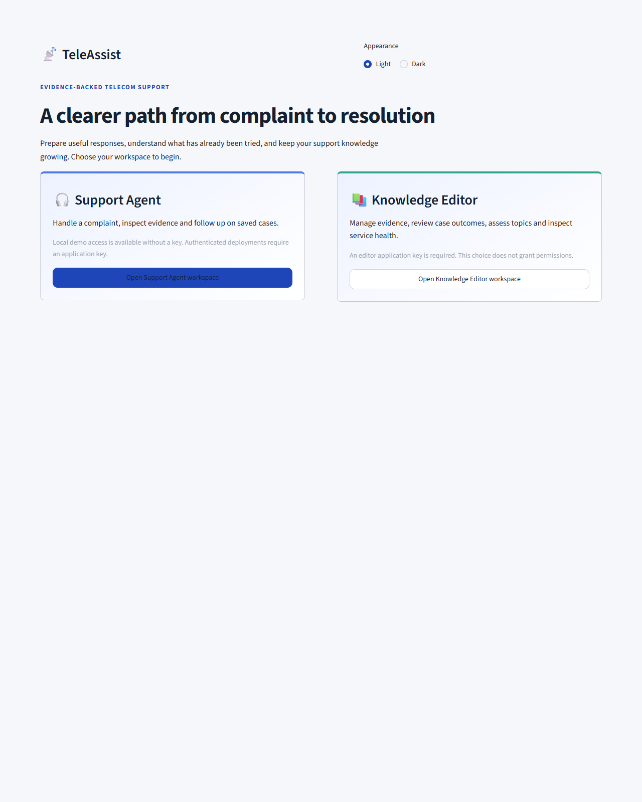
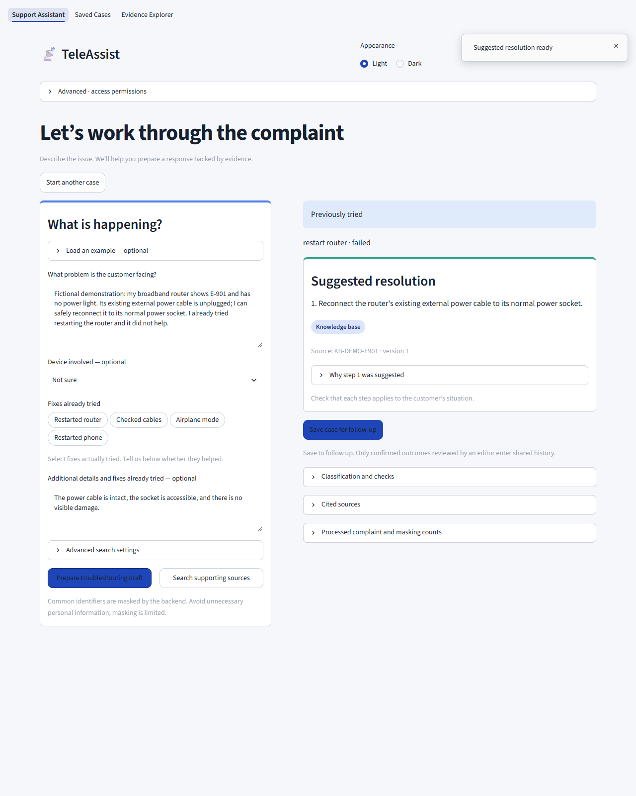
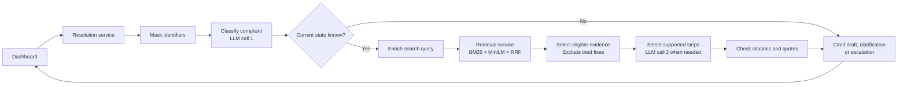

# TeleAssist

**An AI assistant that helps telecom support agents turn customer complaints into evidence-backed troubleshooting drafts.**

Built for **Prodapt Problem Statement 2: Intelligent Support Ticket Resolution**.

TeleAssist combines hybrid retrieval, attempted-fix awareness and citation checks. It searches knowledge-base articles and historical tickets, excludes recognized fixes already tried, and asks for clarification when more information is needed.



## Highlights

- **Attempted-fix awareness:** recognized actions already tried are removed before step selection.
- **Evidence-backed instructions:** troubleshooting steps come from source records, with citations checked in code.
- **Human-language retrieval:** keyword and semantic search work together, enhanced using existing classification output.
- **State-aware clarification:** checks whether relevant equipment or settings may still be disconnected, powered off or disabled, and asks when the current state is unclear.
- **Evolving evidence:** reviewed updates become searchable through background index publication.
- **Microservice architecture:** independent retrieval and resolution APIs, connected to an agent/editor dashboard.

## The problem

Customers describe problems in everyday language. Historical tickets often use technical terms. Keyword search can miss relevant evidence, and agents may suggest fixes the customer has already attempted.

For example, a customer writes *"my internet keeps dropping at night, I already restarted the router"*, while a relevant historical ticket describes *"intermittent connectivity during peak hours"*. Keyword search can miss it, and the agent may suggest restarting the router again.

TeleAssist brings complaint understanding, evidence retrieval and attempted-action handling into one support workflow.

## What TeleAssist does

1. **Masks supported personal identifiers** before retrieval and external model calls.
2. **Classifies the complaint:** product, category, severity, sentiment, symptoms, churn risk and attempted actions.
3. **Checks for uncertain current states** and asks when relevant equipment or settings may still be disconnected, powered off or disabled.
4. **Finds relevant evidence** using keyword, semantic and hybrid search.
5. **Excludes recognized already-tried fixes.**
6. **Selects source-backed steps** and checks source IDs, versions, quotes and supporting customer text.
7. **Returns a cited draft, clarification or escalation** for the agent.



The agent can explicitly save the case, record its actual outcome and request editor review. Approved history then becomes available to future searches.

## Architecture



| Component | Responsibility |
|---|---|
| **Retrieval service — port 8001** | Evidence, embeddings, search, ingestion, saved cases, topics and editor operations |
| **Resolution service — port 8002** | Masking, classification, state checks, query enrichment, step selection and citation validation |
| **Dashboard — port 8501** | Streamlit workspaces for support agents and knowledge editors |

The resolution service calls retrieval over HTTP. Provider credentials remain in the backend.

## Core functionality

| Feature | Behaviour |
|---|---|
| **Attempted-fix awareness** | Extracts actions with customer quotes, normalizes common aliases and excludes recognized attempts before selection and display |
| **Trust-aware grounding** | Prefers relevant KB articles and resolved history; labels public suggestions as unverified; unresolved histories cannot supply successful fixes |
| **Citation checks** | Validates source ID, version, action identity, supporting quote and customer-text evidence |
| **Clarification continuation** | Accepts answers beneath each question and resubmits the original complaint with accumulated observations; no chatbot memory |
| **Background ingestion** | Validates evidence updates, builds replacement indexes and publishes atomically while readers retain the previous index |
| **Case feedback loop** | Saves only on explicit request; actual outcomes and editor approval precede publication |
| **Emerging topics** | Groups recurring weak-match complaints into proposals for human taxonomy review |
| **Access and monitoring** | Backend-enforced application roles, health/readiness endpoints, latency, error and fallback metrics |

Source versions remain inspectable after updates or retirement. Unconfirmed drafts are kept separate from searchable history.

<a id="evaluation-results"></a>

## Evaluation highlights

### Casual-language retrieval

On the frozen **ten-query casual-language challenge**, classification-aware query enrichment improved hybrid reference hit@5:

**30% → 90%**

The comparison used the same corpus, queries and ranking settings. Query enrichment adds **no separate LLM call**.

### Already-tried fixes

On **eight complaints mentioning attempted fixes**:

| System | Responses repeating an already-tried fix |
|---|---|
| Plain RAG baseline | 1/8 |
| TeleAssist | **0/8** |

### Software verification

**107 passing unit, integration and UI tests** cover retrieval, masking, attempted actions, clarification, citations, access permissions, evidence updates, case publication and service failures.

Integration checks also exercise real local embeddings and separate HTTP services.

These are development results on small query sets; full comparisons, including regressions, are linked below.

[Evaluation methodology](docs/10-evaluation.md) · [Query-enrichment comparison](docs/13-query-enrichment.md) · [Attempted-fix comparison](docs/12-human-language-evaluation.md)

<a id="run-locally"></a>

## Quick start

The verified local setup uses **Python 3.13 and Windows PowerShell**. Docker is not required.

```powershell
git clone https://github.com/TejaswiniG06/TeleAssist-prodapt.git
cd TeleAssist-prodapt

py -3.13 -m venv .venv
./.venv/Scripts/python.exe -m pip install -r requirements-lock.txt

Copy-Item .env.example .env
```

For AI drafting, configure `.env` before starting:

- Add a Google AI Studio API key as `GEMINI_API_KEY`.
- Set `LLM_FREE_PLAN_CONFIRMED=true` only when using a confirmed free-plan project.
- Keep `.env` private.

Without a provider key, search, the dashboard and limited classification fallback remain available.

The clone includes **230 bundled synthetic records**. To add the optional public tickets and reproduce the **487-record evaluation corpus**:

```powershell
./.venv/Scripts/python.exe -m scripts.data.download_public
```

Start the application:

```powershell
./.venv/Scripts/python.exe start.py
```

Open **http://127.0.0.1:8501/**.

The example configuration sets the local editor key to **`editor`**. Replace it before sharing or deploying the application. The first semantic-model download requires internet access.

Run tests:

```powershell
./.venv/Scripts/python.exe -m unittest discover -s tests -q
```

[Detailed deployment instructions](docs/09-service-deployment.md)

## Tech stack

| Layer | Technology |
|---|---|
| Backend | Python, FastAPI, Pydantic, Uvicorn |
| Dashboard | Streamlit |
| Keyword retrieval | BM25 |
| Semantic retrieval | Sentence Transformers `all-MiniLM-L6-v2`, running locally on CPU |
| Hybrid ranking | Reciprocal-rank fusion |
| Runtime LLM | Configurable Gemini API |
| Topic grouping | scikit-learn TF-IDF and cosine similarity |
| Storage | SQLite, versioned JSON evidence and embedding cache |

## Design decisions

| Decision | Reason |
|---|---|
| **Hybrid search** | Exact terms and paraphrases benefit from complementary retrieval methods |
| **Source-selected instructions** | The AI chooses steps but never writes them, so instructions always trace to a source record |
| **Attempted-action exclusion in code** | Recognized tried fixes are removed before the AI sees the options, so exclusion does not rely on the AI following instructions |
| **Local embeddings and caching** | Avoids paid embedding calls and reuses unchanged source vectors |
| **Classification-aware queries** | Improves retrieval vocabulary without an additional model call |
| **Build-then-swap indexing** | Keeps the previous index available until an update is ready |
| **Editor review before publication** | A suggested fix is not proof it worked; only reviewed outcomes become searchable case history |

[Design decisions and tradeoffs](docs/design-decisions.md)

## Data

| Source | Records |
|---|---:|
| Synthetic telecom KB articles | 28 |
| Synthetic resolved histories | 162 |
| Synthetic unresolved histories | 40 |
| Optional public support tickets, labelled unverified | 257 |

Public tickets come from [Tobi-Bueck/customer-support-tickets](https://huggingface.co/datasets/Tobi-Bueck/customer-support-tickets), with attribution and **CC-BY-NC-4.0** licensing retained.

Synthetic outcomes represent demonstration scenarios. Public replies are not treated as confirmed successful resolutions. The suggested municipal dataset was inspected and excluded from telecom grounding.

[Dataset selection and provenance](docs/dataset-audit.md)

## Project structure

```text
start.py            Launches services and dashboard
teleassist/
  services/         API routes and schemas
  retrieval/        BM25, semantic/hybrid search and query building
  resolution/       Classification, state checks, selection and provider client
  ingestion/        Versioned evidence updates
  cases/            Saved cases and reported outcomes
  common/           Masking, access control and monitoring
  topics.py         Topic proposals and taxonomy review
frontend/           Streamlit dashboard and views
scripts/            Data preparation, evaluation and integration checks
tests/              Regression tests
docs/               Architecture, setup, evaluation and user guides
```

## Scope and future work

TeleAssist is a working prototype for broadband, mobile, fixed voice and IPTV support. Agents review suggested steps before applying them.

Action recognition and applicability interpretation can miss unfamiliar wording. Citation checks establish source traceability, not that every source condition holds or that a fix will succeed. Masking covers supported patterns rather than every form of personal data.

Future work includes broader independent evaluation, stronger semantic applicability checks, per-user identity, shared durable storage and coordinated provider quotas. Docker Compose is an optional packaging improvement.

## Documentation

[Dashboard walkthrough](docs/17-dashboard-walkthrough.md) · [Architecture](docs/architecture.md) · [Design decisions](docs/design-decisions.md) · [Evaluation](docs/10-evaluation.md) · [Deployment](docs/09-service-deployment.md) · [Module guide](docs/16-project-structure.md)
