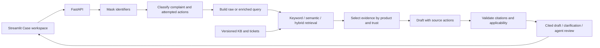

# TeleAssist — Telecom Support Assistant

TeleAssist helps a support agent turn a customer complaint into a cited troubleshooting draft. It classifies the complaint, retrieves relevant knowledge-base articles and historical tickets, and checks proposed steps against the evidence. It supports broadband, mobile, fixed voice and IPTV scenarios for Prodapt problem statement 2.

Its central feature is **attempted-fix awareness**: when a customer says “I already restarted the router,” the system extracts that action and excludes it from recommendations. When information or evidence is insufficient, it asks for clarification or returns an agent-review outcome.

**Status:** working prototype with production-oriented design. Core services and the connected dashboard are implemented; independent evaluation and production deployment requirements remain open.

[Features](#core-functionality) · [Stack](#tech-stack) · [Setup](#run-locally) · [Results](#evaluation-results) · [Scope](#scope-and-production-considerations)

## Core functionality

| Capability | Implemented behaviour |
| --- | --- |
| Complaint understanding | Extract product, category, severity, sentiment, symptoms and attempted actions; flag explicit cancellation intent separately from frustration |
| Retrieval | BM25 keyword search, local semantic search and hybrid reciprocal-rank fusion |
| Query enrichment | Append product, category, normalized symptoms/actions using the existing classification; no extra rewriting LLM call; raw mode remains available |
| Grounded drafting | Prefer relevant KB and resolved histories; disclose unverified suggestions; validate source versions, source actions, quotes and customer applicability evidence |
| Attempted fixes and fallback | Exclude already-tried actions; clarify or escalate when evidence or dependencies are insufficient |
| Privacy and access | Mask common identifiers before provider calls; backend-enforced agent/editor application keys |
| Evolving evidence | Validate editor updates, build indexes in the background, publish atomically, retire records and preserve citation history |
| Case feedback loop | Explicitly save pending drafts, record actual actions/outcomes, and publish historical evidence only after editor review |
| Emerging-topic review | Group weak-match complaints with TF-IDF/cosine; editor approval controls taxonomy changes |
| Monitoring | Liveness/readiness, request/error/fallback counters, bounded latency measurements and process resources |
| Case workspace | Separate Streamlit dashboard with live support, evidence, editor and health screens; independent submissions with no chatbot memory |

## Tech stack

| Layer | Technology | Purpose |
| --- | --- | --- |
| Language | Python 3.13 | Backend, data preparation and evaluation |
| API | FastAPI, Pydantic, Uvicorn | Validated HTTP contracts and service hosting |
| Dashboard | Streamlit | Case workspace connected to the real API |
| Keyword search | Repository BM25 implementation | Inspectable baseline for exact terms |
| Semantic search | Sentence Transformers, `all-MiniLM-L6-v2`, PyTorch on CPU | Local embeddings and cosine similarity |
| Hybrid ranking | Reciprocal-rank fusion (RRF) | Combine keyword and semantic rankings |
| LLM | Configurable Gemini API; checkpoint uses Gemini 3.5 Flash-Lite | Structured classification and drafting |
| Topic grouping | scikit-learn TF-IDF/cosine | Emerging-topic proposals |
| Storage and monitoring | SQLite case ledger, versioned JSON evidence, embedding cache, psutil | Prototype persistence and process measurements |
| Clients and testing | HTTPX, unittest, Streamlit AppTest | Service calls and behavioural verification |

Embeddings run locally. Tests and retrieval do not need an LLM key. Live generation requires the reviewer's own confirmed-free provider project; there is no paid-provider fallback.

## Workflow and architecture



The default backend hosts the routes in one process; the dashboard communicates with it over HTTP. Optional split mode separates retrieval and resolution into two HTTP services. Enrichment changes retrieval text only: original masked customer text remains the evidence used for drafting and applicability checks. Explicit case saving starts a separate feedback loop: pending draft → actual outcome → editor review → published history. Only published evidence is retrieved by future queries.

See [architecture and production deployment](docs/architecture.md), [design decisions](docs/design-decisions.md) and [split-service setup](docs/09-service-deployment.md).

## Evidence and datasets

| Evidence | Records | Treatment |
| --- | ---: | --- |
| Synthetic KB articles | 28 | Illustrative guidance |
| Synthetic resolved histories | 162 | 160 generated plus two original histories; explicit scenario outcomes |
| Synthetic unresolved histories | 40 | Unsuccessful outcomes cannot supply successful fixes |
| Public ticket candidates | 257 | Unverified suggestions with attribution |
| Full evaluation corpus | **487** | Bundled synthetic records plus optional public candidates |

A fresh clone includes **230 synthetic records**. `download_public.py` recreates the 257 public candidates from a pinned, checksum-verified CSV. Committed synthetic records do not need regeneration.

Synthetic guidance is not provider-approved advice; synthetic outcomes do not demonstrate real customer success. Public ticket origins/outcomes remain unverified. The public dataset is attributed to Tobi-Bueck / Softoft under its declared CC-BY-NC-4.0 licence. See [dataset audit and provenance](docs/dataset-audit.md).

## Run locally

### 1. Install and verify

Run in Windows PowerShell with Python 3.13 installed:

```powershell
git clone https://github.com/TejaswiniG06/TeleAssist-prodapt.git
cd TeleAssist-prodapt
py -3.13 -m venv .venv
./.venv/Scripts/python.exe -m pip install -r requirements-lock.txt
./.venv/Scripts/python.exe -m pip check
./.venv/Scripts/python.exe -m unittest discover -s tests -v
```

`requirements-lock.txt` contains verified dependency versions; `requirements.txt` contains compatible ranges. The latest checkpoint passes **78 tests**. Behavioural tests use local/fake dependencies without provider credentials. An earlier published checkpoint was also verified in a fresh Python 3.13 environment.

### 2. Start the backend and dashboard

First terminal:

```powershell
./.venv/Scripts/python.exe -m uvicorn api:app --host 127.0.0.1 --port 8000
```

Second terminal, from the same repository folder:

```powershell
./.venv/Scripts/python.exe -m streamlit run dashboard.py
```

| Interface | Address |
| --- | --- |
| Case workspace | http://127.0.0.1:8501 |
| API documentation | http://127.0.0.1:8000/docs |
| Original lightweight interface | http://127.0.0.1:8000/ |

Try `slow broadband speed` in Evidence Explorer. Keyword search works without model downloads. Semantic/hybrid search needs internet for the initial local model download. Without an LLM key, resolution returns a clarification fallback; the interface and retrieval remain usable.

### 3. Optional: enable live drafting

Copy the example only if `.env` does not already exist:

```powershell
if (-not (Test-Path -LiteralPath .env)) {
    Copy-Item -LiteralPath .env.example -Destination .env
}
```

Set your own `GEMINI_API_KEY` locally and set `LLM_FREE_PLAN_CONFIRMED=true` only after confirming the intended free plan. Keep the example model/pacing settings initially; restart the backend after configuration changes. Quotas and model availability can vary, and the flag does not inspect billing settings.

The provider key stays on the backend. `.env`, downloaded weights, public downloads and runtime files are ignored by Git. Reviewers do not need the author's credentials or to regenerate the corpus.

Editor screens require a backend-configured `TELEASSIST_EDITOR_KEY`, entered in the dashboard. Application agent/editor keys are separate from the Gemini key. Local mode permits anonymous agent access only. See [access controls](docs/06-access-and-updates.md) and [dashboard configuration](docs/11-case-workspace.md).

To retain a handled complaint, choose **Save pending case** after preparing a response, then open **Saved Cases** to record actual actions and the observed outcome. An editor reviews it before publication through the existing ingestion worker. New complaint clears the form, not saved cases. The masked case ledger persists in ignored `runtime/cases.sqlite3`; published history persists in the evidence overlay. Saving/reviewing makes no LLM calls. See [case feedback and recovery](docs/14-case-feedback.md).

### 4. Reproduce the full retrieval comparison

```powershell
./.venv/Scripts/python.exe download_public.py
./.venv/Scripts/python.exe evaluate_query_enrichment.py
```

The download recreates public candidates in ignored local storage. Cached classifications allow the paired comparison to run **without an LLM key**. Without public setup, the corpus has 230 records and scores may differ from the 487-record checkpoint.

## API overview

| Endpoint | Purpose |
| --- | --- |
| `POST /search` | Keyword, semantic or hybrid evidence retrieval |
| `POST /resolve` | Classification, retrieval and checked drafting/fallback |
| `POST /cases`, `GET /cases`, `GET /cases/{case_id}` | Agent case capture and shared prototype inspection |
| `POST /cases/{case_id}/outcome`, `POST /admin/cases/{case_id}/review` | Agent outcome reporting and editor-only reviewed publication |
| `GET /sources/{source_id}` | Current or exact historical evidence version |
| `GET /taxonomy` | Reviewed classification taxonomy |
| `POST /admin/ingest`, `GET /admin/jobs/{job_id}` | Submit and track editor updates |
| `GET /admin/topics`, `POST /admin/topics/{topic_id}/review` | Review topic proposals |
| `GET /live`, `GET /ready`, `GET /health` | Liveness, readiness and active index information |
| `GET /admin/metrics`, `GET /admin/audit` | Editor monitoring and update audit |

`/resolve` defaults to `query_mode="enriched"`; `"raw"` preserves the original query. `/search` defaults to raw and accepts enriched mode only with an existing classification. Search never calls an LLM. Complete schemas are in `/docs`.

## Evaluation results

These are **development checkpoints**, not independently validated real-world accuracy. Synthetic pilot queries share vocabulary with the corpus. The ten casual/typo queries were separately composed by the coding assistant, not independently written or adjudicated by a human. Reference labels are partial: other returned sources may also be relevant.

### Retrieval: raw → enriched

Both variants use the same 487 records, frozen queries/references, models, ranking settings and thresholds, without product/type filters. One shared classification per input supplies enrichment: 34 initial classifications, zero classification failures and zero separate rewriting calls. Cached replay makes zero provider calls.

| Query set | Retrieval | Reference hit@5 | Partial recall@5 | Reference MRR@5 |
| --- | --- | --- | --- | --- |
| Synthetic pilot, 24 | Keyword | 95.83% → 91.67% | 93.75% → 91.67% | 0.6458 → 0.6424 |
| Synthetic pilot, 24 | Semantic | 95.83% → 100% | 95.83% → 100% | 0.7653 → 0.7896 |
| Synthetic pilot, 24 | Hybrid | 100% → 95.83% | 100% → 95.83% | 0.7882 → 0.7708 |
| Casual/typo challenge, 10 | Keyword | 30% → 80% | 30% → 75% | 0.2333 → 0.4750 |
| Casual/typo challenge, 10 | Semantic | 20% → 60% | 20% → 60% | 0.2000 → 0.3583 |
| Casual/typo challenge, 10 | Hybrid | 30% → 90% | 30% → 90% | 0.2250 → 0.5283 |

- **Reference hit@5:** fraction of queries with a supplied reference in the first five results.
- **Partial recall@5:** mean fraction of each query's supplied references retrieved in the first five.
- **Reference MRR@5:** mean reciprocal rank of the first supplied reference within five; misses contribute zero.

Enrichment helps casual wording but regresses pilot keyword/hybrid results. Both modes remain selectable. Retrieval scores do not measure resolution success or applicability. See [method and regressions](docs/13-query-enrichment.md), [cached classifications](data/query_classifications_v1.json) and [case-level ranks/results](data/query_enrichment_results_v1.json).

### Attempted fixes: matched plain RAG comparison

| Eight complaints mentioning attempted actions | Plain RAG baseline | TeleAssist |
| --- | ---: | ---: |
| Cases repeating a labelled attempted action / all cases | 1/8 (12.5%) | 0/8 (0%) |
| Answers containing steps | 4/8 | 6/8 |
| Repetition among answers containing steps | 1/4 (25%) | 0/6 (0%) |
| Provider / grounding failures | 0 / 0 | 0 / 0 |

This earlier **raw-query ablation** matches model, complaint, evidence, product/trust selection and citation checks. The baseline removes attempted-action extraction from drafting, action exclusion and the no-repeat prompt. Execution order alternates; six contexts contain a labelled repeat opportunity. This is a small comparison, not a benchmark of all RAG systems or a fresh score for enriched generation. Repeat labels still need manual review.

### Classification and grounding

| Diagnostic | Result | Qualification |
| --- | --- | --- |
| Product / category, eight user feature cases | 8/8 each | Author-labelled cases and frozen accepted category aliases |
| Product / category, 13 feature + supplemental cases | 13/13 / 11/13 | Two category mismatches retained |
| Attempted-action extraction | 7/8 (87.5%) | All expected actions found per complaint; one miss retained |
| Mechanical citation pass rate | 6/6 step-bearing answers; seven steps | Seven no-step outcomes excluded; membership/version/quote checks, not semantic entailment |
| User feature checks | 8/8 | Masking, casual restart, mobile, churn, clarification, injection and out-of-scope abstention |
| Earlier product/category/sentiment pilot | 6/6 each | Six fictional cases; independent review pending |
| Earlier severity pilot | 2/6 | Approved urgency policy and independent adjudication pending |
| Public complaint retrieval | Not scored | 25 queries with self/near-duplicate exclusions; relevance labels pending |

See [generation evaluation](docs/12-human-language-evaluation.md) and [committed diagnostic results](data/human_language_results_v1.json). Enriched-generation evaluation and independent applicability review remain open.

### Reliability and system health

All **78 behavioural tests** pass, covering access, masking, attempted actions, dependency failures, unsupported citations, stale updates, failed publication, retirement, reviewed topics, split-service outages and independent dashboard submissions. Case tests cover persistence, idempotent saving, stale revisions, editor-only publication, unresolved/rejected outcomes and restart/failure recovery; the dashboard workflow is tested against the real API. Live checks also exercised provider-backed drafts, mobile layout and add/search/retire without restarting the API.

A local load checkpoint recorded 72 warm requests without errors. Hybrid warm p50/p95 latency was approximately 444/547 ms; the first hybrid search took about 30 seconds, with approximately 537 MiB process RSS at that checkpoint. These are local measurements, not production capacity. See [monitoring methodology](docs/07-monitoring.md).

## Reproduce additional checks

Run scripts from the repository root with `./.venv/Scripts/python.exe`:

| Scripts / arguments | Requirements and purpose |
| --- | --- |
| `evaluate_benchmark.py`, `evaluate_human_language.py` | Local model; raw retrieval baselines; public setup needed for recorded corpus |
| `evaluate_public.py` | Public data and local model; retrieval with leakage exclusions, no invented accuracy |
| `smoke_services.py`, `smoke_updates.py`, `smoke_evolving_data.py` | Local dependencies; model for semantic checks; retrieval and evidence lifecycle |
| `smoke_case_feedback.py` | Real local model, isolated storage; pending case → reviewed history → search and restart recovery; no LLM calls |
| `smoke_split.py`, `benchmark_local.py` | Local model (cached for split check); HTTP separation and local load |
| `smoke_resolution.py`, `evaluate_classification.py` | Your confirmed-free provider key; live resolution/classification diagnostics |
| `evaluate_human_language.py --live` | Provider key and local model; matched attempted-fix/feature evaluation |
| `evaluate_query_enrichment.py --refresh-classifications` | Provider key; explicitly create/resume classification predictions |

Live runs consume free-tier quota and can vary. Human-language live reports remain in ignored runtime storage; `--export-summary` exports a completed summary without raw complaint/provider traces.

## Code organization

| Area | Main modules |
| --- | --- |
| API boundaries | `api.py`, `retrieval_api.py`, `resolution_api.py` |
| Search | `retrieval.py`, `semantic.py`, `retrieval_query.py` |
| Classification and resolution | `resolution.py`, `llm.py`, `privacy.py` |
| Evidence lifecycle and access | `evidence.py`, `catalog.py`, `access.py` |
| Persistent cases and reviewed outcomes | `cases.py`, `case_api.py` |
| Topics and monitoring | `topics.py`, `monitoring.py` |
| Dashboard | `dashboard.py`, `dashboard_client.py` |
| Supporting material | `data/`, data scripts, `evaluate_*.py`, `smoke_*.py`, `tests/`, `docs/` |

The dashboard renders results and sends HTTP requests; the backend owns decisions and permission checks. See [module walkthrough and code defence](docs/05-code-defence.md).

## Scope and production considerations

The prototype demonstrates the complaint-to-draft workflow, evolving evidence, reviewed taxonomy, access controls, monitoring and optional service separation. Responses are support-agent drafts, not autonomous network operations. Dashboard values come from the real API; submissions have no conversation memory.

Production deployment needs per-user identity, TLS, shared versioned storage, durable queues, coordinated publication, shared provider quota controls, backups, retention rules and capacity validation. Current file persistence/in-process locks assume a single writer; application keys are not enterprise user identity. Pattern masking is not comprehensive anonymization, and citation validation cannot prove full semantic applicability.

Remaining work: independent relevance/applicability labels, an approved severity policy, enriched-generation evaluation, final repository cleanup and the architecture/code-defence walkthrough. See [architecture](docs/architecture.md) and [evaluation methodology](docs/10-evaluation.md).

## Documentation

| Topic | Guide |
| --- | --- |
| Data | [Dataset audit](docs/dataset-audit.md), [data foundation](docs/01-data-foundation.md) |
| Retrieval and grounding | [Retrieval services](docs/02-retrieval-services.md), [trust and resolution](docs/03-trust-and-resolution.md) |
| Operations | [Access/updates](docs/06-access-and-updates.md), [monitoring](docs/07-monitoring.md), [topic review](docs/08-emerging-topics.md) |
| Case capture and confirmed history | [Case feedback loop](docs/14-case-feedback.md) |
| Interface and deployment | [Case workspace](docs/11-case-workspace.md), [split services](docs/09-service-deployment.md), [original interface](docs/04-interface.md) |
| Evaluation | [Pilot method](docs/10-evaluation.md), [human-language comparison](docs/12-human-language-evaluation.md), [query enrichment](docs/13-query-enrichment.md) |
| Design | [Architecture](docs/architecture.md), [design decisions](docs/design-decisions.md), [code defence](docs/05-code-defence.md) |
