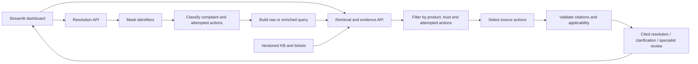

# TeleAssist — Telecom Support Assistant

TeleAssist is a telecom support assistant built for Prodapt problem statement 2. It classifies customer complaints, searches knowledge-base articles and historical tickets, and selects troubleshooting steps with source citations. It supports broadband, mobile, fixed voice and IPTV.

Its main feature is **attempted-fix awareness**. When the system recognizes a fix the customer has already tried, it removes that action before step selection and checks again before displaying the response. If details or evidence are missing, it asks questions or recommends specialist review.

**Status:** working microservices prototype with a connected dashboard, persistent case storage, versioned evidence, monitoring and **107 passing tests**. Production requirements and evaluation limits are described below.

[Dashboard walkthrough](docs/17-dashboard-walkthrough.md) · [Features](#core-functionality) · [Stack](#tech-stack) · [Setup](#run-locally) · [Results](#evaluation-results) · [Scope](#scope-and-production-considerations)


**User flow:** complaint → cited resolution or clarification → recorded outcome → editor review → searchable history.

The [dashboard walkthrough](docs/17-dashboard-walkthrough.md) explains each screen. Screenshots were updated on 5 October 2026 using synthetic demo cases in separate storage.

## Core functionality

| Capability | Implemented behaviour |
| --- | --- |
| Complaint understanding | Extract product, category, severity, sentiment, symptoms and attempted actions; flag explicit cancellation intent separately from frustration |
| Retrieval | BM25 keyword search, local semantic search and hybrid reciprocal-rank fusion |
| Query enrichment | Add product, category, symptoms and normalized actions from the existing classification; no extra model call; original-query mode remains available |
| Evidence-based step selection | Prefer relevant KB articles and resolved history; label unverified suggestions; check source versions, actions, quotes and applicability evidence |
| Attempted fixes and fallback | Exclude recognized already-tried actions; ask questions or recommend review when a supported resolution is unavailable |
| Current-state clarification | Distinguish an attempted action from a restored prerequisite; confirm removed SIMs, disconnected cables, powered-off devices and disabled settings before selecting steps |
| Privacy and access | Mask common identifiers before provider calls; backend-enforced agent/editor application keys |
| Evolving evidence | Validate editor updates, build indexes in the background, publish atomically, retire records and preserve citation history |
| Case feedback loop | Explicitly save pending drafts, record actual actions/outcomes, and publish historical evidence only after editor review |
| Emerging-topic review | Group weak-match complaints with TF-IDF/cosine; editor approval controls taxonomy changes |
| Monitoring | Liveness/readiness, request/error/fallback counters, bounded latency measurements and process resources |
| Case workspace | Agent/editor workspaces, optional device details, clarification answers, relevance ranks, light/dark appearance and readable editor screens; no chatbot memory |

## Tech stack

| Layer | Technology | Purpose |
| --- | --- | --- |
| Language | Python 3.13 | Backend, data preparation and evaluation |
| API | FastAPI, Pydantic, Uvicorn | Validated HTTP contracts and service hosting |
| Dashboard | Streamlit | Case workspace connected to the real API |
| Keyword search | Repository BM25 implementation | Inspectable baseline for exact terms |
| Semantic search | Sentence Transformers, `all-MiniLM-L6-v2`, PyTorch on CPU | Local embeddings and cosine similarity |
| Hybrid ranking | Reciprocal-rank fusion (RRF) | Combine keyword and semantic rankings |
| Runtime LLM | Configurable Gemini API; checkpoint uses Gemini 3.5 Flash-Lite | Structured classification and evidence-step selection |
| Topic grouping | scikit-learn TF-IDF/cosine | Emerging-topic proposals |
| Storage and monitoring | SQLite case ledger, versioned JSON evidence, embedding cache, psutil | Prototype persistence and process measurements |
| Clients and testing | HTTPX, unittest, Streamlit AppTest | Service calls and behavioural verification |

Embeddings run locally. Tests and retrieval work without a provider key. Live classification and resolution need a key from a confirmed free-tier project. There is no paid-provider fallback.

## Workflow and architecture



The launcher starts two FastAPI services and a separate Streamlit dashboard:

- **Retrieval and evidence service:** owns search, embeddings, ingestion, cases and topics.
- **Resolution service:** calls retrieval over HTTP and handles masking, classification, step selection and response checks.
- **Dashboard:** sends API requests and presents the results. The backend enforces permissions.

The embedding cache uses the model and evidence text to reuse unchanged vectors. Evidence updates build a replacement index in the background and publish it atomically. Searches keep using the active index during the update. Source versions remain available for old citations.

Query enrichment changes search text only. The original masked complaint is used for applicability checks. Saving a case starts a separate feedback loop; pending drafts enter searchable history only after outcome recording and editor approval. The combined API remains available as a compatibility mode.

See [architecture and production deployment](docs/architecture.md), [design decisions](docs/design-decisions.md) and [split-service setup](docs/09-service-deployment.md).

## Evidence and datasets

| Evidence | Records | Treatment |
| --- | ---: | --- |
| Synthetic KB articles | 28 | Illustrative guidance |
| Synthetic resolved histories | 162 | Explicit scenario actions and outcomes |
| Synthetic unresolved histories | 40 | Unsuccessful outcomes cannot supply successful fixes |
| Public ticket candidates | 257 | Unverified suggestions with attribution |
| Full evaluation corpus | **487** | Bundled synthetic records plus optional public candidates |

A fresh clone includes **230 synthetic records**. `scripts/data/download_public.py` recreates the 257 public candidates from a pinned, checksum-verified CSV. Committed synthetic records do not need regeneration.

Synthetic records represent telecom scenarios; their outcomes are not measured customer results. Public tickets retain unverified labels and attribution to Tobi-Bueck / Softoft under CC-BY-NC-4.0. See [dataset audit and provenance](docs/dataset-audit.md).

## Run locally

### 1. Install and verify

Run in Windows PowerShell with Python 3.13 installed:

```powershell
git clone https://github.com/TejaswiniG06/TeleAssist-prodapt.git
cd TeleAssist-prodapt
py -3.13 -m venv .venv
./.venv/Scripts/python.exe -m pip install -r requirements-lock.txt
./.venv/Scripts/python.exe -m pip check
./.venv/Scripts/python.exe -m unittest discover -s tests -v
```

`requirements-lock.txt` pins tested dependency versions; `requirements.txt` lists compatible ranges. The suite passes **107 unit, integration and UI tests**. Tests use local models or test doubles and do not require provider credentials. A previous checkpoint was also tested in a fresh Python 3.13 environment.

### 2. Start the microservices and dashboard

From the repository folder:

```powershell
./.venv/Scripts/python.exe start.py
```

This starts two independent FastAPI processes and Streamlit. Retrieval owns evidence, embeddings, cases, ingestion and topics; resolution calls retrieval over HTTP and owns classification, drafting and checks. The launcher warms semantic search without calling the LLM, configures dashboard addresses, writes service logs to `runtime/logs`, and stops its own process trees when you press Ctrl+C. Docker is not required.

| Interface | Address |
| --- | --- |
| Case workspace | http://127.0.0.1:8501 |
| Retrieval/evidence API documentation | http://127.0.0.1:8001/docs |
| Resolution API documentation | http://127.0.0.1:8002/docs |
| Original lightweight interface | http://127.0.0.1:8002/ |

The combined backend remains available: `./.venv/Scripts/python.exe start.py --mode combined` (API port 8000). Stop the current setup before switching; never run two retrieval writers against the same storage. For manual startup, authentication and keyword-only startup, see [service deployment](docs/09-service-deployment.md).

Try `slow broadband speed` in Evidence Explorer. Keyword search works without model downloads. Semantic/hybrid search needs internet for the initial local model download. Without an LLM key, resolution returns a clarification fallback; the interface and retrieval remain usable.

Search cards show **Relevance rank: N of M**, where M is the number of results returned. Match details contains BM25, cosine similarity and hybrid RRF scores. These describe retrieval relevance, not answer accuracy or the chance that a fix will work. Resolution steps show their source references and expandable supporting evidence.

### 3. Optional: enable live drafting

Copy the example only if `.env` does not already exist:

```powershell
if (-not (Test-Path -LiteralPath .env)) {
    Copy-Item -LiteralPath .env.example -Destination .env
}
```

Set your own `GEMINI_API_KEY` locally and set `LLM_FREE_PLAN_CONFIRMED=true` only after confirming the intended free plan. Keep the example model/pacing settings initially; restart the backend after configuration changes. Quotas and model availability can vary, and the flag does not inspect billing settings.

The provider key stays on the backend. `.env`, model weights, public downloads and runtime files are ignored by Git. Use your own key; the bundled corpus does not need regeneration.

Editor screens require a backend-configured `TELEASSIST_EDITOR_KEY`, entered in the dashboard. The example uses `editor` as a public localhost demo key; change it before any shared deployment. This is an application access key, with no user accounts or password database. Application agent/editor keys are separate from the Gemini key. Local mode permits anonymous agent access only. See [access controls](docs/06-access-and-updates.md) and [dashboard configuration](docs/11-case-workspace.md).

Choose Support Agent on the landing page, or choose Knowledge Editor and verify your application editor key. Role choice never grants backend permissions. Collapsed demo examples only fill the form; optional device context is added to observations; clarification replies retain the complaint and use the existing API without chatbot memory; selected action chips describe actions actually tried with unknown results. Advanced access/search controls remain available. See [dashboard interaction design](docs/15-dashboard-experience.md).

To retain a handled complaint, choose **Save case for follow-up** after preparing a draft, then open **Saved Cases** to record actual actions and the observed outcome. An editor reviews it before publication through the existing ingestion worker. Start another case clears the form, not saved cases. The masked case ledger persists in ignored `runtime/cases.sqlite3`; published history persists in the evidence overlay. Saving/reviewing makes no LLM calls. See [case feedback and recovery](docs/14-case-feedback.md).

### 4. Reproduce the full retrieval comparison

```powershell
./.venv/Scripts/python.exe -m scripts.data.download_public
./.venv/Scripts/python.exe -m scripts.evaluation.evaluate_query_enrichment --replay-frozen-classifications
```

The download recreates public candidates in ignored local storage. Cached classifications allow the paired comparison to run **without an LLM key**. Without public setup, the corpus has 230 records and scores may differ from the 487-record checkpoint.

## API overview

| Endpoint | Purpose |
| --- | --- |
| `POST /search` | Keyword, semantic or hybrid evidence retrieval |
| `POST /resolve` | Classification, retrieval and checked drafting/fallback |
| `POST /cases`, `GET /cases`, `GET /cases/{case_id}` | Agent case capture and shared prototype inspection |
| `POST /cases/{case_id}/outcome`, `POST /admin/cases/{case_id}/review` | Agent outcome reporting and editor-only reviewed publication |
| `GET /sources/{source_id}` | Current or exact historical evidence version |
| `GET /taxonomy` | Reviewed classification taxonomy |
| `POST /admin/ingest`, `GET /admin/jobs/{job_id}` | Submit and track editor updates |
| `GET /admin/topics`, `POST /admin/topics/{topic_id}/review` | Review topic proposals |
| `GET /live`, `GET /ready`, `GET /health` | Liveness, readiness and active index information |
| `GET /admin/metrics`, `GET /admin/audit` | Editor monitoring and update audit |

`/resolve` defaults to `query_mode="enriched"`; `"raw"` preserves the original query. `/search` defaults to raw and accepts enriched mode only with an existing classification. Search never calls an LLM. Complete schemas are in `/docs`.

## Evaluation results

These results use development query sets and partial reference labels. Synthetic pilot queries share vocabulary with the corpus. The separate ten-query challenge uses casual wording and typos. The query sets and labels have not had independent human review, so these results do not establish real-world accuracy. Other retrieved sources may also be relevant.

These frozen results predate the October 6 current-state clarification update. Historical retrieval replay uses the earlier cached predictions; the updated classifier needs a separate evaluation before claiming the same quality scores. Common prerequisite rules are bounded, and broader state interpretation still depends on the LLM; neither guarantees coverage of every complaint.

### Retrieval: raw → enriched

Both variants use the same 487 records, frozen queries/references, models, ranking settings and thresholds, without product/type filters. One shared classification per input supplies enrichment: 34 initial classifications, zero classification failures and zero separate rewriting calls. Cached replay makes zero provider calls.

| Query set | Retrieval | Reference hit@5 | Partial recall@5 | Reference MRR@5 |
| --- | --- | --- | --- | --- |
| Synthetic pilot, 24 | Keyword | 95.83% → 91.67% | 93.75% → 91.67% | 0.6458 → 0.6424 |
| Synthetic pilot, 24 | Semantic | 95.83% → 100% | 95.83% → 100% | 0.7653 → 0.7896 |
| Synthetic pilot, 24 | Hybrid | 100% → 95.83% | 100% → 95.83% | 0.7882 → 0.7708 |
| Casual/typo challenge, 10 | Keyword | 30% → 80% | 30% → 75% | 0.2333 → 0.4750 |
| Casual/typo challenge, 10 | Semantic | 20% → 60% | 20% → 60% | 0.2000 → 0.3583 |
| Casual/typo challenge, 10 | Hybrid | 30% → 90% | 30% → 90% | 0.2250 → 0.5283 |

- **Reference hit@5:** fraction of queries with a supplied reference in the first five results.
- **Partial recall@5:** mean fraction of each query's supplied references retrieved in the first five.
- **Reference MRR@5:** mean reciprocal rank of the first supplied reference within five; misses contribute zero.

Enrichment helps casual wording but regresses pilot keyword/hybrid results. Both modes remain selectable. Retrieval scores do not measure resolution success or applicability. See [method and regressions](docs/13-query-enrichment.md), [cached classifications](data/query_classifications_v1.json) and [case-level ranks/results](data/query_enrichment_results_v1.json).

### Attempted fixes: matched plain RAG comparison

| Eight complaints mentioning attempted actions | Plain RAG baseline | TeleAssist |
| --- | ---: | ---: |
| Cases repeating a labelled attempted action / all cases | 1/8 (12.5%) | 0/8 (0%) |
| Answers containing steps | 4/8 | 6/8 |
| Repetition among answers containing steps | 1/4 (25%) | 0/6 (0%) |
| Provider / grounding failures | 0 / 0 | 0 / 0 |

This **raw-query ablation** uses the same model, complaints, evidence, product/trust selection and citation checks. The baseline disables attempted-action handling and its no-repeat prompt. Six contexts contain an opportunity to repeat a labelled action. This small comparison evaluates the safeguard; it does not measure all RAG systems or enriched-generation quality. Repeat labels need independent review.

### Classification and grounding

| Diagnostic | Result | Qualification |
| --- | --- | --- |
| Product / category, eight feature cases | 8/8 each | Development labels and fixed accepted category aliases |
| Product / category, 13 feature + supplemental cases | 13/13 / 11/13 | Two category mismatches retained |
| Attempted-action extraction | 7/8 (87.5%) | All expected actions found per complaint; one miss retained |
| Mechanical citation pass rate | 6/6 step-bearing answers; seven steps | Seven no-step outcomes excluded; membership/version/quote checks, not semantic entailment |
| User feature checks | 8/8 | Masking, casual restart, mobile, churn, clarification, injection and out-of-scope abstention |
| Earlier product/category/sentiment pilot | 6/6 each | Six synthetic cases; independent review pending |
| Earlier severity pilot | 2/6 | Needs an approved urgency policy and independent review |
| Public complaint retrieval | Not scored | 25 queries with self/near-duplicate exclusions; relevance labels pending |

See [generation evaluation](docs/12-human-language-evaluation.md) and [committed diagnostic results](data/human_language_results_v1.json). Enriched-generation evaluation and independent applicability review remain open.

### Reliability and system health

All **107 tests** pass. They cover masking, attempted-fix exclusion, current-state clarification, citation checks, permissions, service failures, version conflicts, evidence updates and case recovery. Integration tests cover case saving, outcome review and publication against both combined and split APIs. UI tests cover clarification replies, role checks, themes, case navigation and evidence forms. Live browser checks cover provider-backed responses, narrow screens and add/search/retire without restarting the API.

A local load checkpoint recorded 72 warm requests without errors. Hybrid warm p50/p95 latency was approximately 444/547 ms; the first hybrid search took about 30 seconds, with approximately 537 MiB process RSS at that checkpoint. These are local measurements, not production capacity. See [monitoring methodology](docs/07-monitoring.md).

## Reproduce additional checks

Run tools from the repository root with module syntax, for example:

```powershell
./.venv/Scripts/python.exe -m scripts.smoke.smoke_split
./.venv/Scripts/python.exe -m scripts.evaluation.evaluate_query_enrichment --replay-frozen-classifications
./.venv/Scripts/python.exe -m scripts.data.prepare_tickets --help
```

Module syntax keeps project imports consistent. The tool inventory is:

| Scripts / arguments | Requirements and purpose |
| --- | --- |
| `scripts/evaluation/evaluate_benchmark.py`, `scripts/evaluation/evaluate_human_language.py` | Local model; raw retrieval baselines; public setup needed for recorded corpus |
| `scripts/evaluation/evaluate_public.py` | Public data and local model; excludes originating tickets and near duplicates before retrieval evaluation |
| `scripts/smoke/smoke_services.py`, `scripts/smoke/smoke_updates.py`, `scripts/smoke/smoke_evolving_data.py` | Local dependencies; model for semantic checks; retrieval and evidence lifecycle |
| `scripts/smoke/smoke_case_feedback.py` | Real local model, isolated storage; pending case → reviewed history → search and restart recovery; no LLM calls |
| `scripts/smoke/smoke_split.py`, `scripts/evaluation/benchmark_local.py` | Local model (cached for split check); HTTP separation and local load |
| `scripts/smoke/smoke_resolution.py`, `scripts/evaluation/evaluate_classification.py` | Your confirmed-free provider key; live resolution/classification diagnostics |
| `scripts/evaluation/evaluate_human_language.py --live` | Provider key and local model; matched attempted-fix/feature evaluation |
| `scripts/evaluation/evaluate_query_enrichment.py --refresh-classifications` | Provider key; explicitly create/resume classification predictions |

Live runs consume free-tier quota and can vary. Human-language live reports remain in ignored runtime storage; `--export-summary` exports a completed summary without raw complaint/provider traces.

## Code organization

| Area | Main modules |
| --- | --- |
| API boundaries | `teleassist/services/`: routes, shared request schemas and case endpoints; root files retain startup compatibility |
| Search | `teleassist/retrieval/keyword.py`, `teleassist/retrieval/semantic.py`, `teleassist/retrieval/query.py` |
| Classification and resolution | `teleassist/resolution/pipeline.py`, `teleassist/resolution/llm.py`, `teleassist/common/privacy.py` |
| Evidence lifecycle and access | `teleassist/retrieval/evidence.py`, `teleassist/ingestion/catalog.py`, `teleassist/common/access.py` |
| Persistent cases and reviewed outcomes | `teleassist/cases/store.py`, `teleassist/services/case_routes.py` |
| Topics and monitoring | `teleassist/topics.py`, `teleassist/common/monitoring.py` |
| Dashboard | `frontend/app.py`, five `frontend/views/`, shared components/styles and HTTP client; `dashboard.py` is the entry point |
| Supporting material | `scripts/data/`, `scripts/evaluation/`, `scripts/smoke/`, `data/`, `tests/`, `docs/` |

The dashboard renders results and sends HTTP requests; the backend owns decisions and permission checks. See [project structure](docs/16-project-structure.md).

## Scope and production considerations

The prototype demonstrates the complaint-to-draft workflow, evolving evidence, reviewed taxonomy, access controls, monitoring and separate retrieval/resolution APIs. Responses are support-agent drafts, not autonomous network operations. Dashboard values come from the real API; submissions have no conversation memory.

Production deployment needs per-user identity, TLS, shared versioned storage, durable queues, coordinated publication, shared provider quota controls, backups, retention rules and capacity validation. Current file persistence/in-process locks assume a single writer; application keys are not enterprise user identity. Pattern masking is not comprehensive anonymization, and citation validation cannot prove full semantic applicability.

Further evaluation needs independent relevance/applicability labels, an approved severity policy, enriched-generation results and broader topic-quality measurement. See [architecture](docs/architecture.md) and [evaluation methodology](docs/10-evaluation.md).

## Documentation

| Topic | Guide |
| --- | --- |
| Data | [Dataset audit](docs/dataset-audit.md), [data foundation](docs/01-data-foundation.md) |
| Retrieval and grounding | [Retrieval services](docs/02-retrieval-services.md), [trust and resolution](docs/03-trust-and-resolution.md) |
| Operations | [Access/updates](docs/06-access-and-updates.md), [monitoring](docs/07-monitoring.md), [topic review](docs/08-emerging-topics.md) |
| Case capture and confirmed history | [Case feedback loop](docs/14-case-feedback.md) |
| Dashboard user flow | [Screenshot walkthrough](docs/17-dashboard-walkthrough.md), [interaction design](docs/15-dashboard-experience.md) |
| Interface and deployment | [Case workspace](docs/11-case-workspace.md), [split services](docs/09-service-deployment.md), [original interface](docs/04-interface.md) |
| Evaluation | [Pilot method](docs/10-evaluation.md), [human-language comparison](docs/12-human-language-evaluation.md), [query enrichment](docs/13-query-enrichment.md) |
| Design | [Architecture](docs/architecture.md), [design decisions](docs/design-decisions.md), [project structure](docs/16-project-structure.md) |
