# TeleAssist dashboard walkthrough

This guide explains the user flow from a complaint to reviewed historical evidence. It supplements the [README](../README.md), [architecture](architecture.md) and [evaluation results](../README.md#evaluation-results).

## What these screenshots demonstrate

Captured from application code at commit `6e5af6c` on 4 October 2026 from the actual Streamlit dashboard connected to separate retrieval and resolution APIs, using local semantic retrieval and the configured confirmed-free Gemini provider. All complaints, guidance and outcomes shown here are fictional demonstration records in an isolated database. The working application's saved cases were not changed. No API credentials are displayed.

The E-901 guide was added specifically for this walkthrough and is labelled `synthetic_demo`; E-901 is a demonstration identifier, not a claimed manufacturer error code. Its conditions explicitly describe an unplugged, intact external power cable that can safely be reconnected. This simple example demonstrates traceable grounding, not independently verified telecom troubleshooting quality. Screenshot counts and source references reflect this isolated capture state, not fixed values for every installation.

The default clone includes 230 synthetic records. The optional public download adds 257 unverified candidates. This capture also includes the demonstration article and its subsequently published fictional case. Real customer confirmation cannot be inferred from a screenshot or a synthetic outcome.

## 1. Choose a workspace

**Support Agent** handles complaints and follows up on cases. **Knowledge Editor** manages shared evidence, case publication and topic reviews. An authorized person can perform both tasks, but editor access requires a backend-verified application key. Appearance selects Light or Dark without changing permissions.

## 2. Describe the complaint

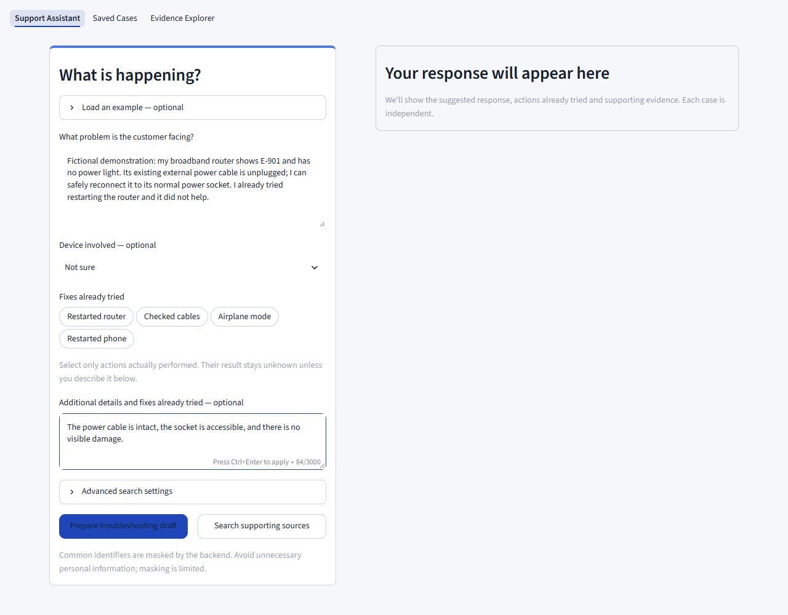

Enter the customer's complaint. Device involved and additional observations are optional. Select action tags only for actions actually tried; report whether they helped in the observations. Load an example is a collapsed demo shortcut. Advanced search preserves the original-wording comparison mode.

**Prepare troubleshooting draft** runs masking, classification, retrieval, drafting and response checks. **Search supporting sources** performs retrieval without drafting. No case is stored merely by preparing a response. Expand Classification and checks to inspect the proposed product, category, severity, sentiment, attempted actions and explicit cancellation signal. Processed complaint and masking counts shows the text processed after common identifiers are masked; pattern masking is limited, so avoid unnecessary personal data.

## 3. Review the cited draft and attempted fixes

The displayed router restart is recognized as already tried and failed. The returned draft proposes a different action, citing `KB-DEMO-E901` version 1. This is an actual provider-backed response, not text inserted into the UI for the screenshot. The agent must still review whether the conditions apply.

## 4. Expand the supporting evidence

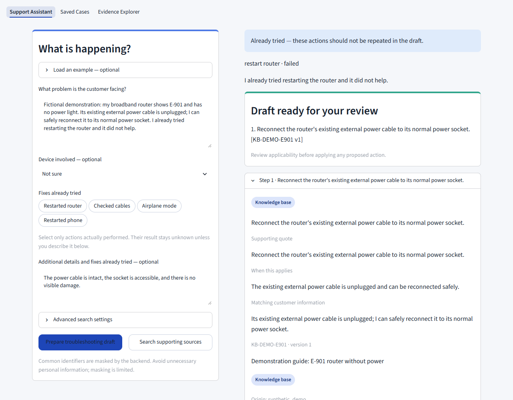

Each step exposes its source tier, supporting quote, applicability condition and matching customer information. Source cards retain exact cited versions. KB and resolved history are preferred; public suggestions are unverified and unresolved history is not proof of a successful fix. Citation checks reduce unsupported output but do not establish perfect semantic accuracy.

## 5. Answer clarification questions when necessary

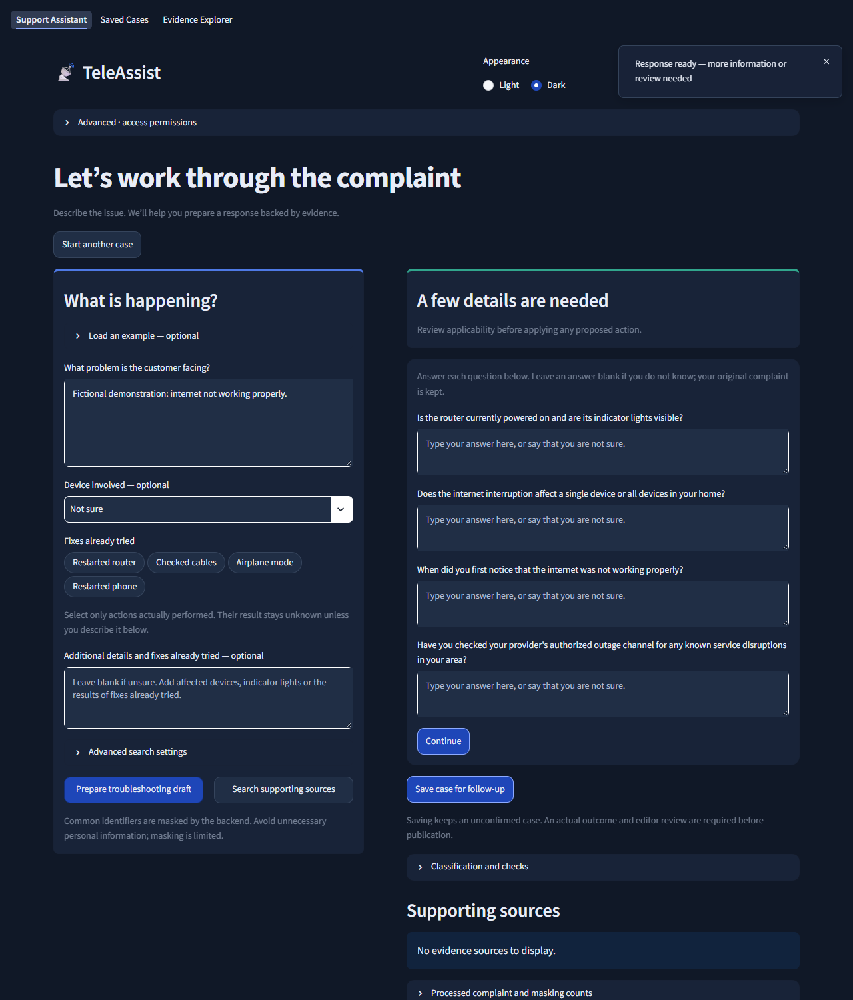

A vague complaint returns questions instead of a confident fix. Answer directly beneath each question and select Continue. The UI retains the original complaint and sends the supplied answers as current-case observations through the same API. It does not create chatbot memory. Leave unknown answers blank or state that you are unsure.

## 6. Explicitly save and follow up on a case

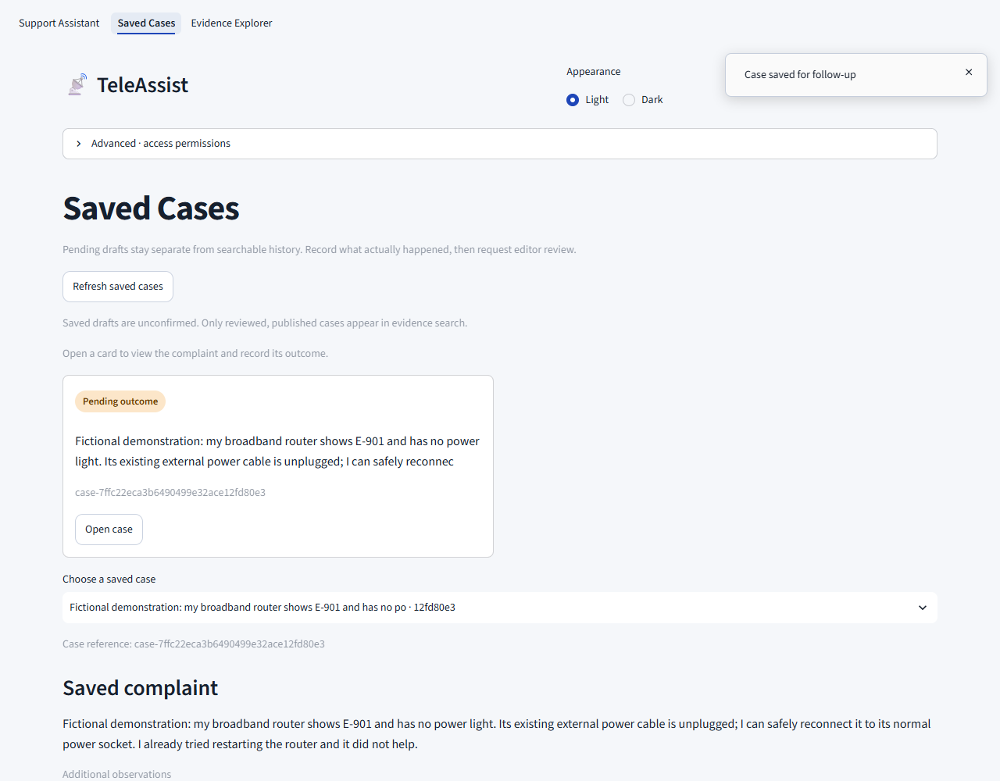

Save case for follow-up creates a masked, unconfirmed snapshot. Saved Cases lets the agent open that case and later record the actions actually performed, the observed outcome and what confirms it. Leave it pending until there is a real reported or observed outcome. Do not copy suggested steps and assume they succeeded.

For this isolated demonstration, the reported cable reconnection and customer confirmation are explicitly fictional. TeleAssist has no customer portal or automatic success detector; a support agent records customer updates.

## 7. Review before publishing shared knowledge

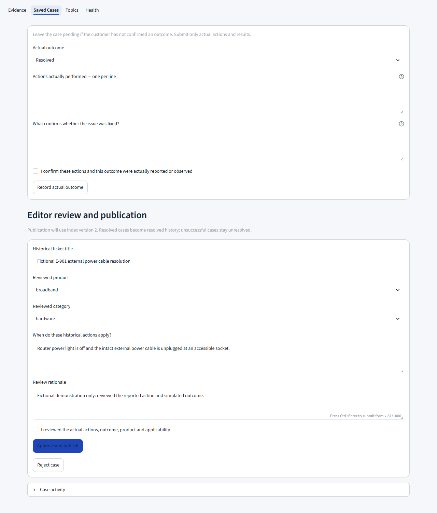

An editor checks the outcome, service/category and applicability, explains the decision and confirms the review. Approve and publish submits a version-checked background update. Reject case prevents publication. Review is a human attestation, not independent proof that a real fix worked.

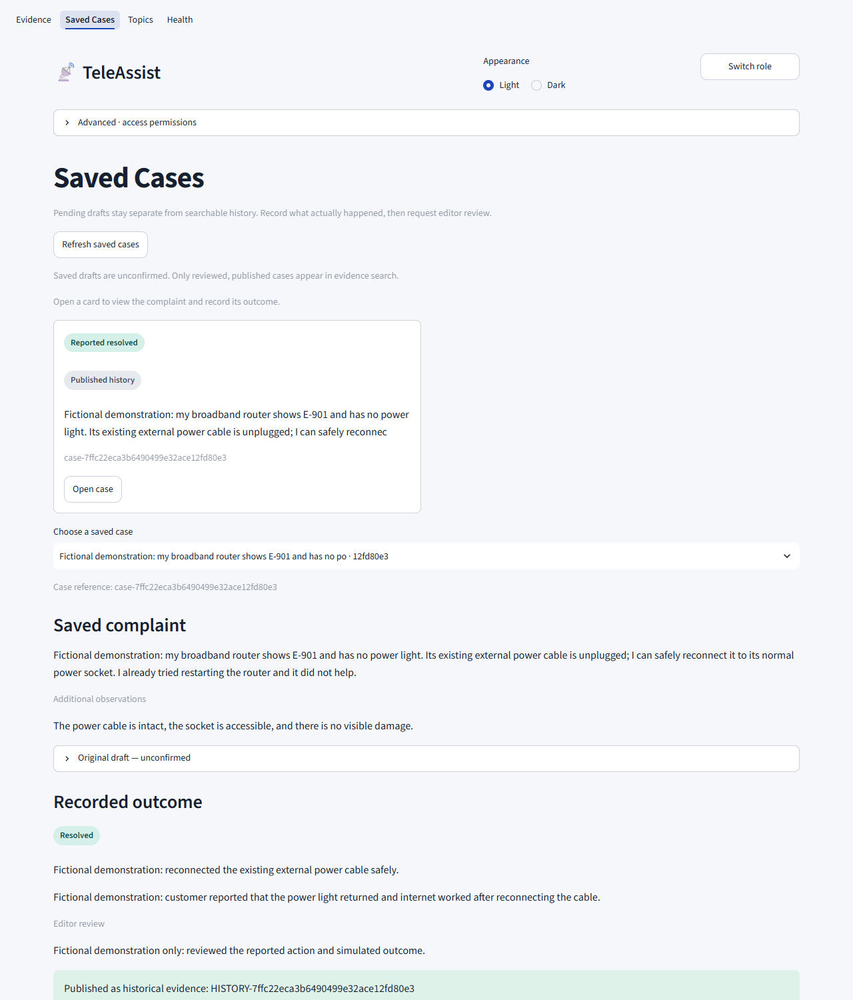

After publication succeeds, the case shows its historical source reference and version. Pending drafts remain separate. Unsuccessful outcomes retain unresolved labels rather than becoming successful-fix evidence.

## 8. Retrieve articles and published history

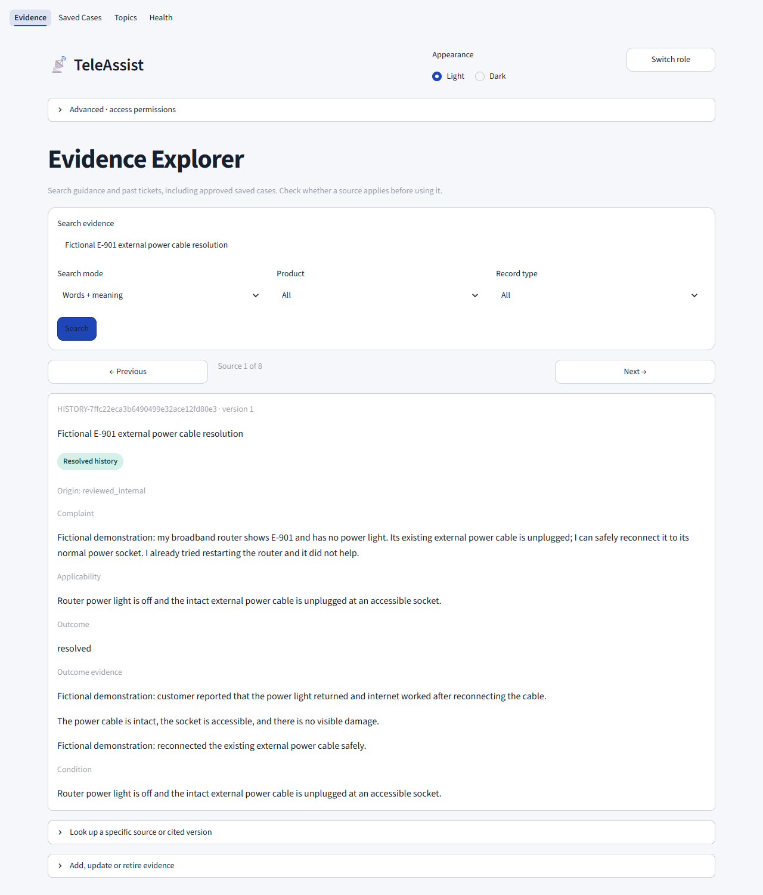

Evidence Explorer searches articles and past tickets, including approved cases. Choose matching words, similar meaning or both; product/type filters narrow the pool. Similarity alone does not prove applicability. A specific source/version lookup lets reviewers inspect a citation even after newer versions exist.

The current dashboard displays Relevance rank: N of M, with M representing the returned results (added after these screenshots). Exact BM25, cosine similarity and hybrid ranking scores remain under Match details. They are retrieval scores, not answer-confidence percentages. Source text is expandable. The resolution view now displays each selected step once, with its source reference and optional applicability details; complete cited sources are grouped in a collapsed section.

## 9. Maintain the evidence collection

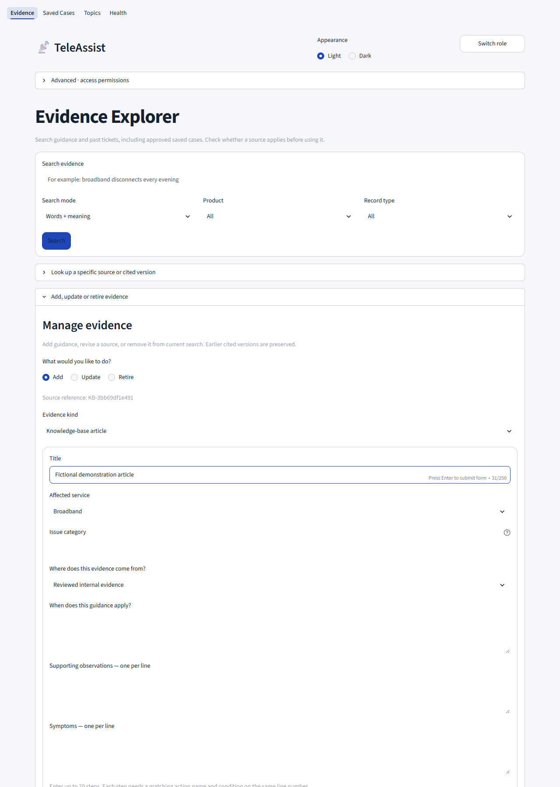

Add creates an article or historical record with explicit origin and conditions. Update loads a current source for review. Retire removes it from current search while preserving citation history. Forms construct the existing API request; backend validation, permissions and expected-version conflicts still apply. Jobs build replacement indexes while readers retain the active snapshot.

Check an evidence update reports whether the submitted job is queued, building, published or failed. Publication activity records changes. Optional developer batch import is available, but human editors do not need to enter JSON for normal maintenance.

## 10. Review emerging issues

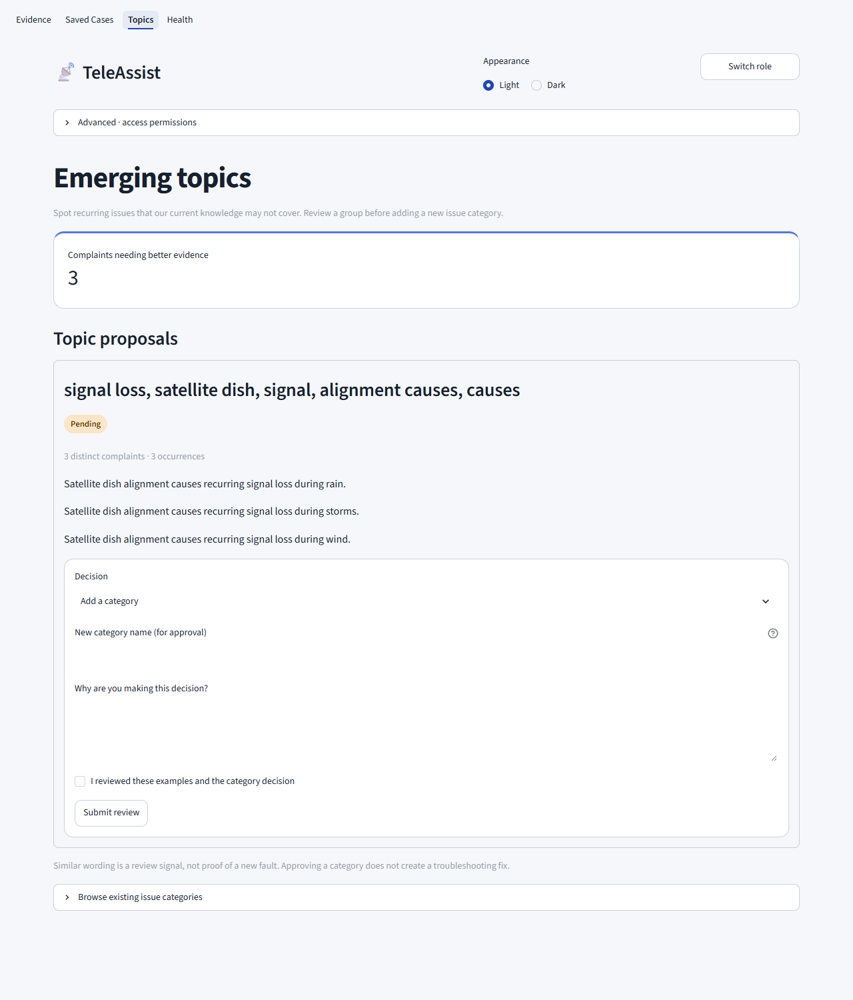

Weak-match complaints are grouped with TF-IDF and cosine similarity. For this screenshot, three fictional satellite-alignment complaints were explicitly submitted to the observation API to exercise the proposal screen. This does not demonstrate validated automatic detection quality or prove a new fault.

Reviewers can add a category or dismiss a proposal, with a rationale and confirmation. Adding a category does not create a fix or retrain the model. Existing category labels can be searched; they are not automatically merged or renamed.

## 11. Inspect health and failures

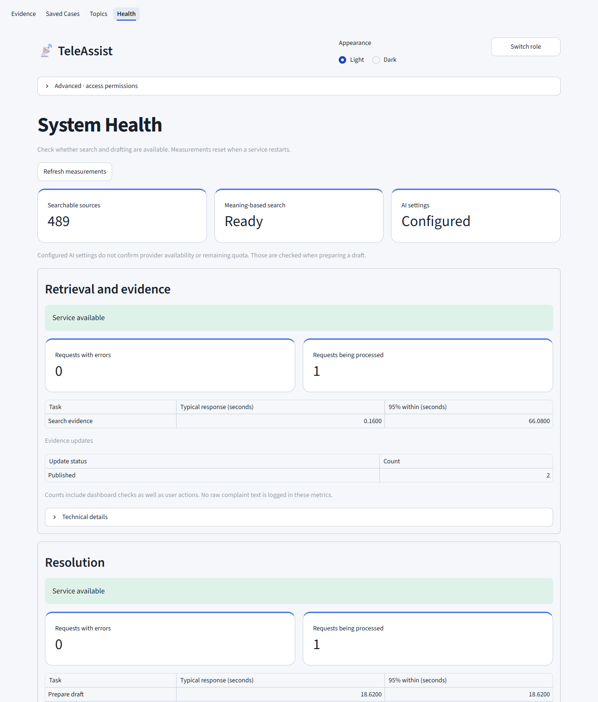

Health reports searchable sources, meaning-based search readiness, AI configuration and separate service status. Response times, errors, outcomes and update state come from the running APIs. Configured AI settings do not confirm provider availability or remaining quota. Counters include dashboard checks and reset on process restart; these measurements are not evaluation accuracy scores.

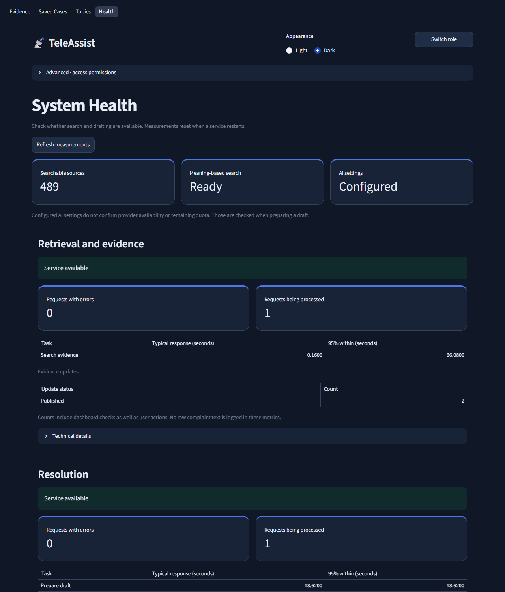

Technical details retain raw diagnostics for debugging while the normal view stays readable. Dark appearance changes presentation, not data or functionality.

## Suggested evaluator demo

1. Follow the [local setup](../README.md#run-locally) and start `python start.py` inside the installed environment.
2. Submit a fictional complaint mentioning an attempted fix; inspect the detected action and returned draft or clarification.
3. Expand a cited step and inspect its exact source version. Answer clarification if requested.
4. Explicitly save a case, record an actual outcome and review it with editor permissions.
5. Search the published history, demonstrate an evidence update/retirement, and open Topics and Health.

To reproduce the E-901 illustration, add a synthetic-demo broadband article titled “Demonstration guide: E-901 router without power”, category `no_connection`, with the action `check_power_connection`. Use the instruction “Reconnect the router's existing external power cable to its normal power socket” only under the condition “The existing external power cable is unplugged and can be reconnected safely.” Enter those explicit conditions in the fictional complaint, as shown in the screenshots. This guide is not bundled into the normal corpus or evaluation queries.

An API key is needed for live AI generation; reviewers use their own confirmed-free key. Without it, retrieval works and resolution returns a safe clarification fallback. Do not treat the walkthrough's simulated outcomes as genuine customer evidence.

## What remains to evaluate

These screenshots demonstrate executable user flows. The project still needs independent relevance/applicability review, an approved severity policy, enriched-generation evaluation and broader topic-quality assessment. See [evaluation methodology](10-evaluation.md) for denominators and limitations. Production identity, shared durable storage, distributed quotas and deployment capacity remain separate production requirements.
