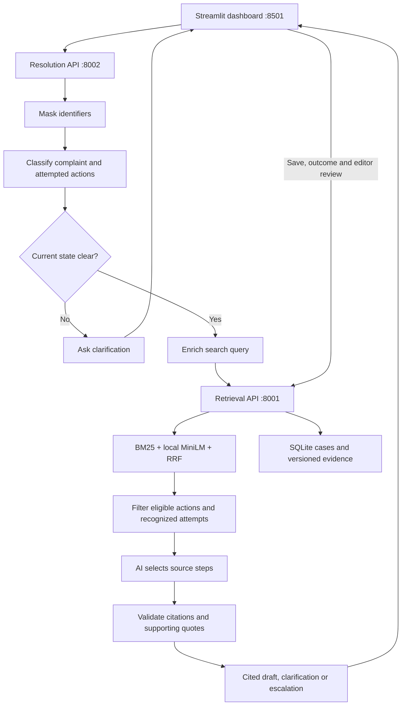
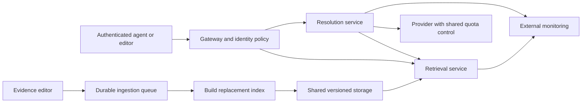

# Architecture and workflows

TeleAssist runs two independent FastAPI services and a Streamlit dashboard. Retrieval owns evidence and saved-case storage; resolution handles complaint understanding and checked step selection. The services communicate over HTTP.

## Complaint workflow

| Component | Owns |
| --- | --- |
| Retrieval API, port 8001 | Evidence, embeddings, search, source versions, ingestion, cases and topic proposals |
| Resolution API, port 8002 | Masking, classification, state checks, query construction, provider calls and citation checks |
| Dashboard, port 8501 | Agent/editor navigation, forms and response presentation |

The combined API remains a compatibility mode. See [deployment](deployment.md) for configuration and process startup.

## Retrieval and caching

BM25 handles exact terms. Local `all-MiniLM-L6-v2` embeddings handle meaning-based matching through cosine similarity. Hybrid search combines candidate ranks using reciprocal-rank fusion: each appearance contributes `1 / (60 + rank)`, using a 20-result pool from each method. Raw scores are not answer-confidence percentages.

Product/type filters and retired-source exclusions apply before ranking. The embedding cache uses model identity and a hash of searchable text; unchanged records reuse vectors, while changed text is recomputed. The first semantic request downloads or loads the model. An embedding failure leaves keyword search available and returns 503 for semantic/hybrid requests.

Resolution enriches the masked complaint and observations with the existing classification's product, category, symptoms and normalized actions. Severity, sentiment and churn are omitted. The builder uses no extra model call, excludes unknown/duplicate metadata and bounds the query to 2,000 characters, including at most 600 metadata characters. Raw mode remains available for comparison.

`POST /search` performs retrieval without an LLM call. Enriched search requires a supplied classification. `POST /resolve` classifies first and uses enriched mode by default. Classification metadata helps search; it cannot serve as customer evidence for a condition. See [evaluation](evaluation.md#query-enrichment-comparison) for the paired comparison.

## Classification, current state and grounding

Pattern masking runs before retrieval and hosted model calls. Classification extracts product, category, severity, sentiment, symptoms, attempted actions and explicit churn evidence. Attempts require a quote from the submitted customer text. Common aliases normalize to action IDs; recognized attempts are excluded even when their outcome is unknown.

An attempted action does not establish current state. Local prerequisite rules check common disconnected, powered-off or disabled states. The existing classification call can propose other state questions using customer quotes. Unknown state returns clarification before step selection. Both yes and no answers establish state; a negative answer does not mean the prerequisite has been restored. Answered questions are filtered from later responses. If no supported next step exists, the service escalates.

Resolution retrieves separate candidate pools so public replies cannot crowd out articles/history. Its context reserves three KB and three resolved-history slots, plus one unverified and one unresolved record when available; unused slots are filled from relevant candidates. A development cosine threshold of 0.32 gates eligibility before trust preference. Search defaults to 0.30. These thresholds require evaluation rather than being interpreted as confidence.

The model selects eligible source actions. Code checks source ID, version, action identity, supporting quote and a passage from the original customer context. Instructions come from the selected record. Unverified suggestions disclose their uncertain origin/outcome; unresolved histories cannot supply successful fixes. Fabricated citations, unsupported quotes, duplicate actions and suspicious instructions produce a safe fallback.

Citation checks establish traceability, not full semantic applicability or a guaranteed repair. Unfamiliar action wording, unmet conditions and overly generic fallbacks remain answer-quality risks. Agents review suggested steps. See [design decisions](design-decisions.md) for safeguards and tradeoffs.

## Background evidence updates

Editors submit `POST /admin/ingest` with an expected index version and complete records, each with an expected source version (0 for new records). Schema, provenance, outcome requirements and suspicious text are checked; supported identifiers are masked before persistence. Structural validation cannot prove that a reported outcome occurred.

The API returns HTTP 202 and a job ID. One worker builds replacement keyword/semantic indexes while searches retain the previous snapshot. Validated overrides and history are persisted atomically before the active snapshot is swapped. Failed preparation keeps the previous evidence; stale versions and overlapping jobs return 409. Updates reuse unchanged cached embeddings.

Retirement removes a source from current search while retaining historical versions at `/sources/{id}?version=N`. Publication audit records roles, times, source/index versions and status, without keys or complaints. Rollback means submitting historical content as a new revision. Operational updates live in ignored runtime storage, leaving bundled datasets unchanged.

## Saved-case feedback loop

1. An agent explicitly saves a masked complaint, observations, classification and draft snapshot.
2. The agent records actions actually performed, the outcome and how it was confirmed.
3. An editor reviews product/category, applicability, actual actions and the outcome, then approves or rejects publication.
4. Approval uses background ingestion. Resolved cases become resolved history; unsuccessful cases retain unresolved labels.
5. Published history is available to future searches. Pending drafts remain separate from evidence.

Saving, outcome recording and review make no LLM calls. Review is a human attestation, not independent proof of success. Cases are shared within this prototype; there is no customer portal, automatic success detector or chatbot memory.

| Endpoint | Permission |
| --- | --- |
| `POST /cases`, `GET /cases`, `GET /cases/{id}` | Agent |
| `POST /cases/{id}/outcome` | Agent, with expected case revision |
| `POST /admin/cases/{id}/review` | Editor |

Client request IDs make identical save retries idempotent; conflicting reuse returns 409. Case states are `pending`, `outcome_recorded`, `publishing`, `published` and `rejected`. Stale revisions and edits during/after publication are rejected. A corrected rejected outcome can be reviewed again.

SQLite transactions persist revisions/events. Case and evidence storage are separate, so they do not share a distributed transaction: reads reconcile publication against durable source history. Failed unpublished jobs return the case to outcome recording; evidence committed before acknowledgement restores published status on inspection. Case deletion remains future work.

## Emerging topics

Repeated weak matches are review signals for gaps in evidence. Unfiltered searches below cosine 0.40, keyword searches with no matches, and no-applicable-evidence resolution fallbacks can enter the monitor. Provider failures and deliberately filtered/excluded searches do not count as novelty.

The monitor keeps at most 200 distinct pattern-masked complaints. Identical text increases occurrences, not independent membership. TF-IDF word/bigram vectors and cosine similarity of at least 0.35 link complaints; groups with three distinct members become proposals. These are explainable heuristics, not a validated novelty detector.

Editors inspect examples/terms and approve a category or reject a proposal with a rationale. `GET /taxonomy` returns corpus categories plus approvals; classification uses this finite list. Ingestion requires approved categories. Approval changes taxonomy only: it does not add evidence, create a fix or retrain a model. Reviews and samples persist locally; a storage failure does not stop search, but prevents an unpersisted approval.

## Monitoring

| Endpoint | Meaning |
| --- | --- |
| `/live` | The HTTP process responds; no provider check |
| `/ready` | Keyword readiness; `require_semantic=true` additionally requires semantic readiness |
| `/health` | Evidence counts, index version, semantic state and provider configuration |
| `/admin/metrics` | Editor-only request/error counts, latency, outcomes, fallbacks, jobs and resources |

Metrics use route templates and omit complaint bodies, observations and keys. Counters cover each process lifetime and reset on restart. Latency retains the latest 256 samples per route. AI configuration does not prove provider availability; fallback counts describe past requests. Operational measurements and answer-quality evaluations are separate. See [evaluation](evaluation.md#local-performance-measurement).

## Production deployment path

This diagram describes future deployment work. The current catalog supports one writer and one ingestion worker; job state is in memory. Horizontal scaling requires shared storage, coordinated publication, durable jobs and distributed quotas. Public hosting also requires HTTPS, per-user identity, backups, encryption and retention controls. Adopt a vector database when measured corpus size, memory or query rate justifies it.

Measure cold/warm latency, generation latency, memory, queue delay, errors and fallbacks before setting capacity targets. Service separation permits independent scaling, but does not establish a production throughput guarantee.
