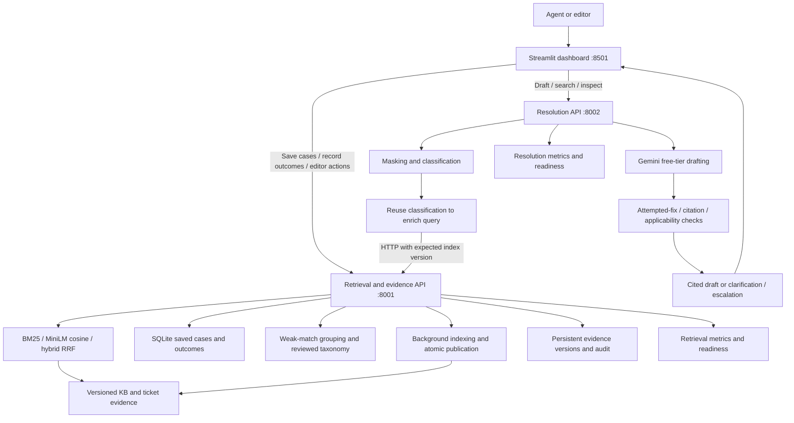
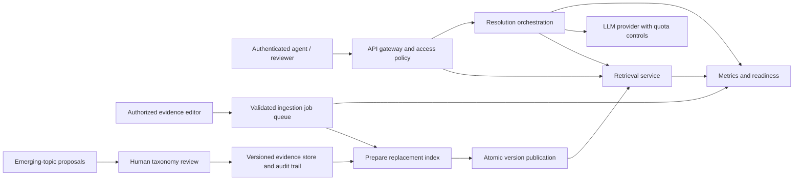

# Architecture and design defence

## Executable prototype today

The recommended reviewer startup runs retrieval_api and resolution_api as separate HTTP processes, reusing the same tested modules; see [service deployment](09-service-deployment.md). The combined api process remains a compatibility mode. Access roles, validated background publication, reviewed topic proposals and process metrics are also implemented. The provider key stays server-side. Pattern masking occurs before provider calls; it is not comprehensive anonymization. Search returns ranked evidence, whereas resolve applies additional trust and grounding rules. Only resolve generates a draft.

The source corpus contains synthetic KB/history and lower-trust public replies. A failed historical outcome cannot supply a successful fix. Citation checks validate membership and copied evidence, but do not prove full semantic entailment or real-world resolution. A support agent reviews the draft.

## Decisions the author should be able to explain

| Decision | Reason | Tradeoff / validation needed |
| --- | --- | --- |
| Keep BM25 | Cheap, inspectable baseline for exact terms | Paraphrases may miss; compare on labelled queries |
| Run embeddings locally | No paid embedding API; enables semantic matching | First model load and CPU/memory cost must be measured |
| Fuse ranks with RRF | Combines exact and semantic signals without comparing incompatible raw scores | Fixed fusion settings are a baseline; quality is not yet established |
| Reuse classification to enrich the query | Bridges casual wording to telecom terms without another LLM call | Paired evaluation improves hard-query retrieval but regresses pilot hybrid; raw mode remains available |
| Use explicit evidence tiers | Retains public language without inventing verified outcomes | Trust alone cannot establish relevance or applicability |
| Select actions from source records | Limits invented operational instructions and exposes provenance | Evidence conditions still need customer confirmation; checker is not a complete safety proof |
| Clarify on uncertainty/failure | Avoids offering unchecked steps when dependencies or evidence fail | More abstentions; measure useful resolution and appropriate fallback together |
| Separate Streamlit dashboard and API | Small Python UI with real HTTP separation; original lightweight page remains available | Additional process; single-writer local storage does not establish production scale |
| One free provider with bounded retries | Keeps the cost constraint and predictable failure handling | Provider quotas and availability constrain generation |

## Production deployment path — beyond the local prototype

The local prototype demonstrates the main behaviours with small components and tests. Production deployment still needs external identity/gateway integration, shared stores and a durable queue. Service separation can scale retrieval independently of generation and ingestion. Multiple workers require shared version state, coordinated publication, persistent jobs and a shared provider quota limiter; current in-process locks do not provide these guarantees. A versioned datastore and an indexed vector backend become justified when measured corpus size, query rate or memory exceeds local limits. No arbitrary user-count capacity claim is made.

Measure corpus load time, cold/warm search latency, generation latency, process memory, queue delay and fallback/error rates. Test failed ingestion, missing provider, invalid source versions and concurrent readers. Set capacity and service objectives from measurements and deployment needs. Provider timeouts/circuit breaking, backups, rollback, encrypted storage, least-privilege access and retention policy are production requirements to discuss and validate before a real deployment.
