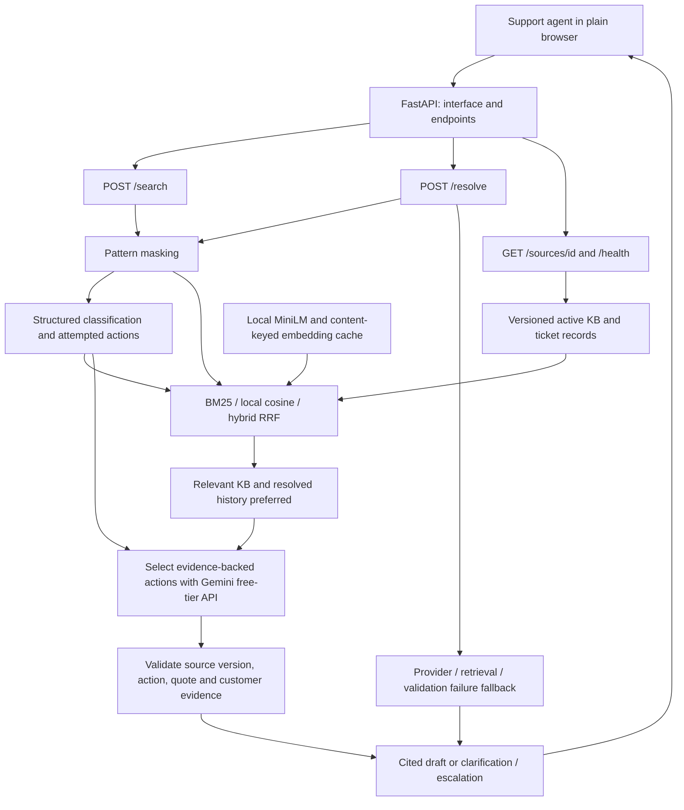
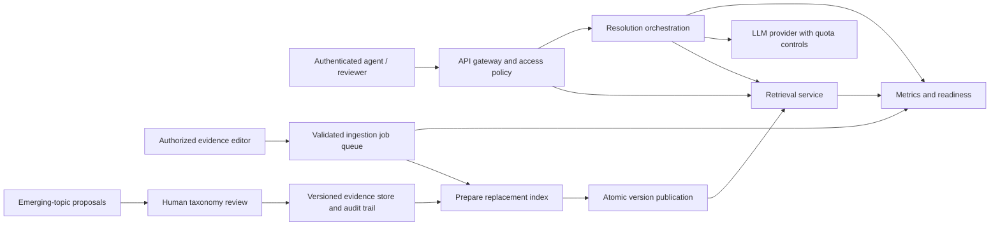

# Architecture and design defence

## Executable prototype today

All API routes currently run in one Python process. The components are separate modules, not independently deployed microservices. The provider key stays server-side. Pattern masking occurs before provider calls; it is not comprehensive anonymization. Search returns ranked evidence, whereas resolve applies additional trust and grounding rules. Only resolve generates a draft.

The source corpus contains synthetic KB/history and lower-trust public replies. A failed historical outcome cannot supply a successful fix. Citation checks validate membership and copied evidence, but do not prove full semantic entailment or real-world resolution. A support agent reviews the draft.

## Decisions the author should be able to explain

| Decision | Reason | Tradeoff / validation needed |
| --- | --- | --- |
| Keep BM25 | Cheap, inspectable baseline for exact terms | Paraphrases may miss; compare on labelled queries |
| Run embeddings locally | No paid embedding API; enables semantic matching | First model load and CPU/memory cost must be measured |
| Fuse ranks with RRF | Combines exact and semantic signals without comparing incompatible raw scores | Fixed fusion settings are a baseline; quality is not yet established |
| Use explicit evidence tiers | Retains public language without inventing verified outcomes | Trust alone cannot establish relevance or applicability |
| Select actions from source records | Limits invented operational instructions and exposes provenance | Evidence conditions still need customer confirmation; checker is not a complete safety proof |
| Clarify on uncertainty/failure | Avoids offering unchecked steps when dependencies or evidence fail | More abstentions; measure useful resolution and appropriate fallback together |
| One plain page and one API process | Easy to run, explain and test for this prototype | Single process and local storage do not establish production scale |
| One free provider with bounded retries | Keeps the cost constraint and predictable failure handling | Provider quotas and availability constrain generation |

## Planned production path — not implemented yet

First demonstrate these behaviours with small local components and tests. Production separation can then scale retrieval independently of generation and ingestion. Multiple workers require shared version state, coordinated publication, persistent jobs and a shared provider quota limiter; current in-process locks do not provide these guarantees. A versioned datastore and an indexed vector backend become justified when measured corpus size, query rate or memory exceeds local limits. No arbitrary user-count capacity claim is made.

Measure corpus load time, cold/warm search latency, generation latency, process memory, queue delay and fallback/error rates. Test failed ingestion, missing provider, invalid source versions and concurrent readers. Set capacity and service objectives from measurements and deployment needs. Provider timeouts/circuit breaking, backups, rollback, encrypted storage, least-privilege access and retention policy are production requirements to discuss and validate before a real deployment.
